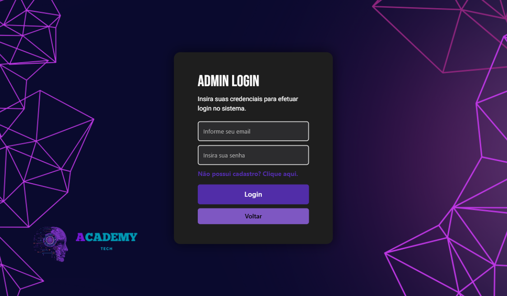
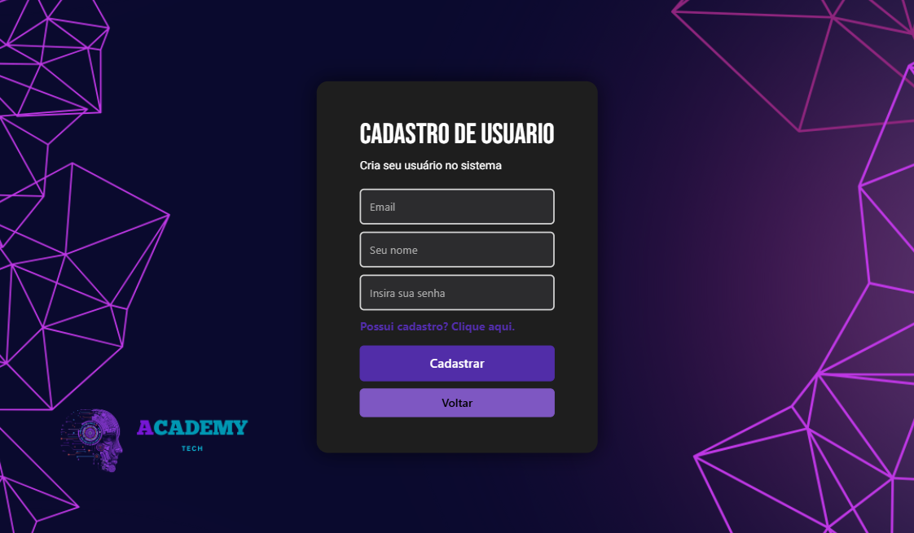
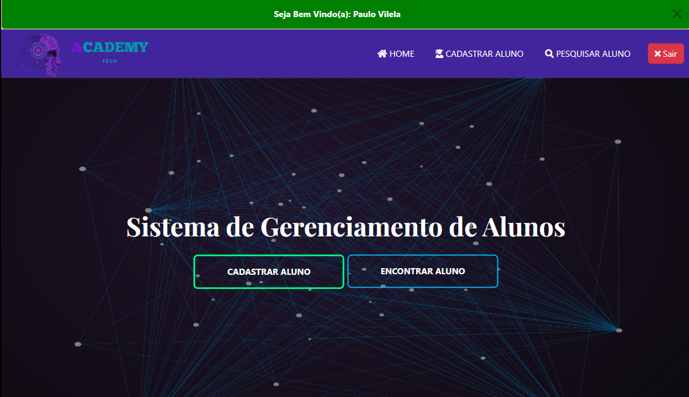
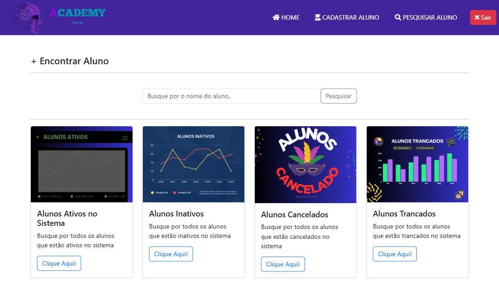

# 🎓 ACADEMY TECH

Sistema web completo para gerenciamento de alunos em academias, desenvolvido com **Java**, **Spring Boot**, **Thymeleaf** e **MySQL**. O sistema possui autenticação de login, cadastro de alunos, listagem, busca por nome e edição de dados.

---

## 🔐 Login

Para acessar o sistema, é necessário fazer login com e-mail e senha cadastrados no banco de dados.

---

## ✅ Funcionalidades

- Autenticação de login
- Cadastro de novos alunos
- Listagem de todos os alunos
- Filtro de alunos por nome
- Edição dos dados do aluno
- Persistência de dados com MySQL
- Interface amigável com HTML + Thymeleaf

---
## 📸 Imagens do Sistema

### Tela de Login



---   

### Tela de Cadastro



---  
### Tela Inicial



---  
### Tela de Pesquisa



---  


## 🛠️ Tecnologias utilizadas

| Camada         | Tecnologias               |
|----------------|---------------------------|
| Backend        | Java 17, Spring Boot      |
| Frontend (View)| Thymeleaf, BootStrap, CSS |
| Banco de Dados | MySQL                     |
| Build          | Maven                     |
| IDE            | IntelliJ IDEA             |
| Designer       | Canva                     |

---

## 📁 Estrutura do Projeto

```
academy/
├── src/
│   ├── main/
│   │   ├── java/
│   │   │   └── br/com/academy/
│   │   │       ├── controllers/
│   │   │       ├── model/
│   │   │       └── dao/
│   │   └── resources/
│   │       ├── templates/
│   │       │   ├── login.html
│   │       │   ├── index.html
│   │       │   └── editar.html
│   │       └── application.properties
└── pom.xml
```

---

## ⚙️ Como rodar localmente

### ✅ Pré-requisitos

- Java JDK 17
- Maven instalado
- MySQL rodando localmente (pode usar o XAMPP)

### 🔧 Configuração do Banco de Dados

1. Inicie o **XAMPP** e ative o módulo **MySQL**
2. Crie um banco com o nome:

```sql
CREATE DATABASE academy;
```

3. Verifique se seu `application.properties` está assim:

```properties
spring.application.name=academy
spring.thymeleaf.mode=HTML
spring.thymeleaf.cache=false

spring.datasource.url=jdbc:mysql://localhost:3306/academy?allowPublicKeyRetrieval=true&useSSL=false
spring.datasource.username=root
spring.datasource.password=  # (deixe em branco se não tiver senha)
spring.datasource.driver-class-name=com.mysql.cj.jdbc.Driver
spring.jpa.hibernate.ddl-auto=update
spring.jpa.properties.hibernate.dialect=org.hibernate.dialect.MySQLDialect

server.port=8080
```

---

### ▶️ Executando o projeto

No terminal ou prompt de comando, vá até a pasta do projeto e digite:

```bash
mvn clean install
mvn spring-boot:run
```

Depois, acesse:

```
http://localhost:8080
```

---

## 🧪 Teste Rápido

1. Acesse a tela de login: `http://localhost:8080/login`
2. Informe um e-mail e senha válidos cadastrados no banco
3. Após login, você será redirecionado para o sistema
4. Teste o cadastro, edição e filtro de alunos

---

## 👨‍💻 Autor

**Paulo Vilela – DEV**

---

## 📄 Licença

Este projeto está licenciado sob os termos da licença MIT.

